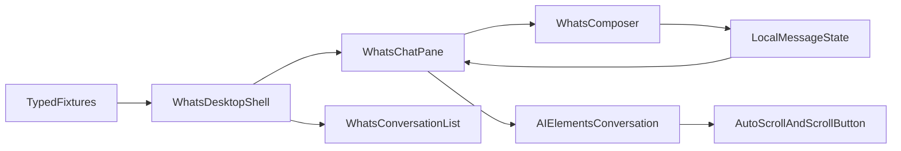

# WhatsApp Web Clone — Visual-First Design Spec

**Date:** 2026-08-30  
**Status:** Design approved in brainstorming; pending written-spec review

## Context

The current `main` branch has one Vite/TanStack application in `apps/web`. That application currently combines:

- the merchant/dashboard shell;
- the WhatsApp-like commerce chat;
- the session inspector;
- delegated jobs and Subagents Live;
- checkout and payment-demo interactions.

The orchestration domain is already implemented in `packages/api/src/commerce/*` and exposed through `packages/api/src/routers/commerce.ts`. The next product boundary is a separate `apps/whats` simulator with its own visual identity, while `apps/web` becomes the merchant-facing dashboard.

## Objective

Build the first vertical slice of `apps/whats` as a visually faithful, light-theme desktop clone of the WhatsApp Web shell before connecting it to the existing backend.

The first slice must validate:

- the visual direction and desktop shell proportions;
- local shadcn/Tailwind token strategy;
- conversation list and chat-pane rendering;
- message bubbles, buttons, carousels, lists, cards, timestamps, and checks;
- composer interaction;
- message insertion;
- loading state;
- autoscroll behavior.

## Explicit Decisions

- First slice is **visual-first**, using typed local fixtures.
- Theme scope for MVP is **light only**.
- Composition is a **full desktop WhatsApp Web shell** at the primary reference viewport of **1440×900**: conversation list/sidebar plus chat pane.
- The app opens with **`y.uno commerce` already selected**.
- Search, extra conversations, generic menus, emoji, reactions, attachments, and other WhatsApp features are visual mock elements unless explicitly required by the commerce MVP.
- Sessions, tracing, inspector, delegated jobs, and subagents are explicitly out of the clone phase and will be handled later.
- `apps/whats` is a separate Vite app with isolated CSS.
- The dashboard does not need to render or embed the simulator in this slice.
- Later, the dashboard may expose a discreet link that opens the simulator in a new tab.
- The first slice does not implement real Meta/WhatsApp/BSP integration.

## Proposed Architecture



The simulator will initially own its presentation and ephemeral interaction state. The later backend slice will replace the local send/response adapter with the existing tRPC commerce contract without requiring a visual rewrite.

## Component Boundaries

Target components for the first slice:

- `WhatsDesktopShell`: full desktop composition and responsive boundaries.
- `WhatsConversationList`: search/header, chat rows, unread/pinned/muted states.
- `WhatsChatHeader`: WhatsApp-style contact/header area.
- `WhatsMessageList`: message rendering inside the conversation container.
- `WhatsMessageBubble`: incoming/outgoing bubble with Whats-specific styling.
- `WhatsInteractiveMessage`: buttons, quick replies, cards, lists, and carousels.
- `WhatsComposer`: text input, submit action, and loading/disabled states.
- `apps/whats/src/index.css`: local Tailwind v4 and shadcn token definitions.

The implementation may use AI Elements components copied into the app:

- `Conversation` for scroll anchoring and the “scroll to bottom” affordance.
- `PromptInput`, `PromptInputTextarea`, and `PromptInputSubmit` for the composer interaction contract.

AI Elements `Message` is optional. If its default structure conflicts with WhatsApp bubble fidelity, the app will render `WhatsMessageBubble` inside `ConversationContent` instead.

The first slice will not use `useChat`, because message delivery is fixture driven and the production transport is tRPC rather than an AI SDK chat route. Interactive fixtures must nevertheless expose callbacks that can later map to commerce envelopes.

## Visual Tokens

The app will define shadcn-compatible base tokens and WhatsApp-specific tokens. The following light-theme values are initial reference values and must be validated against the saved WhatsApp HTML snapshots:

```css
:root {
  --background: #efeae2;
  --foreground: #111b21;
  --muted-foreground: #667781;
  --primary: #00a884;
  --border: #d1d7db;

  --wa-header: #008069;
  --wa-chat-wallpaper: #efeae2;
  --wa-bubble-in: #ffffff;
  --wa-bubble-out: #d9fdd3;
  --wa-composer: #f0f2f5;
  --wa-icon: #54656f;
}
```

The `@hackathon/ui` global stylesheet will not be imported by `apps/whats`. Shared primitive source may be included in Tailwind scanning only if needed; the simulator's global tokens and visual overrides remain local.

## Interaction Contract

The fixture-driven chat supports:

1. Initial conversation list with `y.uno commerce` selected.
2. Search input rendered as a visual mock; it does not need to search.
3. User typing.
4. Enter to submit and Shift+Enter for a newline.
5. Disabled submit while the mock message is being accepted.
6. Immediate insertion of the outgoing message.
7. Simulated assistant response and typing state.
8. Incoming/outgoing bubbles with timestamps and delivery/read states.
9. Commerce-relevant interactive messages:
   - Flow panel opened inside the chat;
   - quick replies and buttons;
   - product/service carousel;
   - purchase summary and checkout-related action when required by the MVP.
10. Automatic scroll to the newest message when appropriate.
11. A scroll-to-bottom affordance when the user is reading older messages.
12. Empty, loading, and simulated error states.

The local adapter should expose the same conceptual boundary that the later tRPC adapter will use:

```ts
type SendMessage = (text: string) => Promise<void>;
```

## AI Elements Decision

AI Elements is appropriate for interaction primitives, not as the source of commerce behavior:

- It can provide the conversation viewport, scroll anchoring, submit form, keyboard behavior, and loading affordance.
- It does not persist messages, call tRPC, manage commerce envelopes, or decide when an assistant response exists.
- Its default visual styles are not expected to match WhatsApp; local classes and wrappers may overwrite them.

The existing `Task`, `Tool`, and `Terminal` components remain assigned to the later observability slice.

## Non-Goals

- Real WhatsApp/Meta API or BSP integration.
- Webhooks, phone-number identity, signatures, or provider retries.
- Session inspector, tracing, delegated jobs, and Subagents Live migration.
- Dark theme.
- Non-MVP WhatsApp behavior: functional chat search, switching between conversations, emoji picker, reactions, attachments, calls, settings, and generic menus.
- Backend checkout integration in the visual-first slice; only a local visual commerce flow is required.
- Changes to the shared `@hackathon/ui` theme.
- Authentication or multi-tenant authorization.

## Testing and Validation

Automated checks:

- `bun check-types`
- `bun check`

Manual checks:

- Shell renders at the reference viewport **1440×900**.
- Conversation list and chat pane maintain the reference proportions.
- Incoming and outgoing bubbles are visually distinct.
- Header, sidebar, wallpaper, composer, text, icon, divider, and bubble colors match the WhatsApp light snapshots closely.
- Captured MVP states can be replayed: `y.uno commerce` selected, composer focus, Flow panel open, quick reply, button, list, carousel, loading, and error.
- Enter and Shift+Enter behave correctly.
- New messages do not break scroll position.
- Scroll-to-bottom appears when the user leaves the bottom.
- Loading and disabled states are visible and recover correctly.
- `apps/web` styling is unchanged.

Visual reference files:

- `/Users/isaque/Downloads/(189) WhatsApp (8_29_2026 6：57：34 PM).html`
- `/Users/isaque/Downloads/(189) WhatsApp (8_29_2026 6：54：34 PM).html`
- `/Users/isaque/Downloads/(188) WhatsApp (8_29_2026 7：59：54 PM).html`

When a required state is not represented by these files, the implementation must pause and request a new HTML shot or screenshot for that exact state instead of guessing.

## Success Criteria

The first slice is complete when:

- `apps/whats` exists as an independent Vite app;
- it renders a light full desktop WhatsApp Web shell at 1440×900 with local fixtures;
- its CSS does not import `@hackathon/ui/globals.css`;
- its composer supports send, disabled/loading, Enter, and Shift+Enter;
- new messages are pushed into the conversation;
- commerce-relevant interactive fixtures render and respond correctly;
- autoscroll and scroll-to-bottom behavior work;
- the implementation passes `bun check-types` and `bun check`;
- visual review confirms the direction is good enough to proceed to backend integration.

## Follow-up Slices

After this spec is accepted:

1. Write the implementation plan for the full-shell visual-first slice.
2. Implement the isolated app, shell, fixtures, and token layer.
3. Replace fixtures with the shared tRPC commerce adapter.
4. Move sessions/tracing/subagents into the simulator boundary or establish a dedicated observability view.
5. Convert `apps/web` into the Petz merchant dashboard and add the discreet simulator link.
6. Add deployment wiring for the second Vite website.
